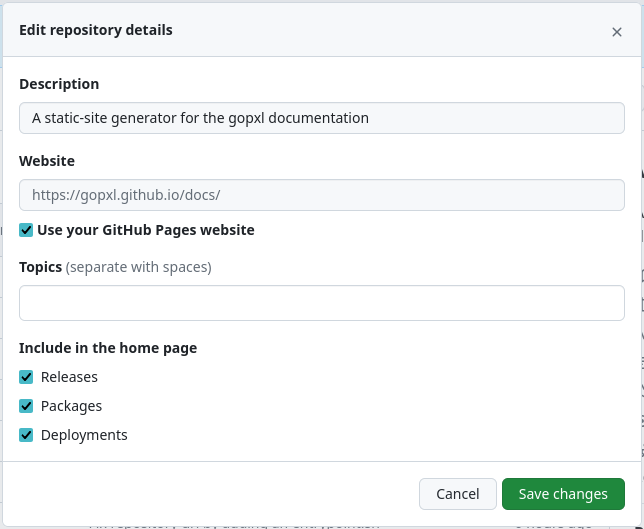

# Installation

## Enabling GitHub Pages

In your repository on GitHub, go to Settings → Pages.<br>
Under Build and deployment → Source, change the option to `GitHub Actions`.

## Creating a GitHub Workflow

In your project, create a GitHub Workflow file:
```yaml
# .github/workflows/github-pages.yml
name: GitHub Pages

on:
  push:
    branches: ['main']
    tags: ['*']

jobs:

  upload-docs:
    runs-on: ubuntu-latest
    permissions:
      pages: write
      id-token: write
    env:
      DOCS_DIR: 'docs/'
      DEST_DIR: '_site/'
      BRANCH: 'main'
    steps:
      - uses: actions/configure-pages@v5
        id: configure-pages
      - uses: actions/checkout@v3
        with:
          ref: ${{ env.BRANCH }}
          fetch-depth: 0 # checkout a non-shallow copy so the generator can generate docs for all major versions
      - uses: gopxl/docs@main
        with:
          deploy-url: ${{ steps.configure-pages.outputs.base_url }}
          docs-directory: ${{ env.DOCS_DIR }}
          destination-directory: ${{ env.DEST_DIR }}
      - uses: actions/upload-pages-artifact@v3
        with:
          path: ${{ env.DEST_DIR }}
      - uses: actions/deploy-pages@v4
```

The `DOCS_DIR` environment variable can be changed to point
to the directory containing the MarkDown files.

## Linking the site from the GitHub repository

Optionally, it's possible to configure the GitHub Pages site as website
of the  GitHub repository. This way, it will be linked in the About section.
To do this, click on the cog icon in the top-right corner in the About section:


This will open a dialog where a website can be configured. Enable "Use your GitHub Pages website"
and click on "Save changes" and you're good to go.



The GitHub Pages link will be displayed below the description:


## Viewing your website

It is also possible to determine the website URL using the repository URL.
If your GitHub repository is hosted at `https://github.com/owner/project`,
your GitHub Pages site will be available at `https://owner.github.io/project`.